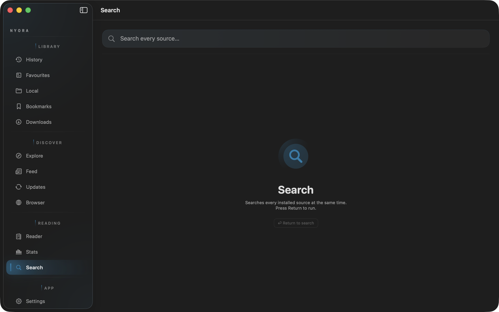
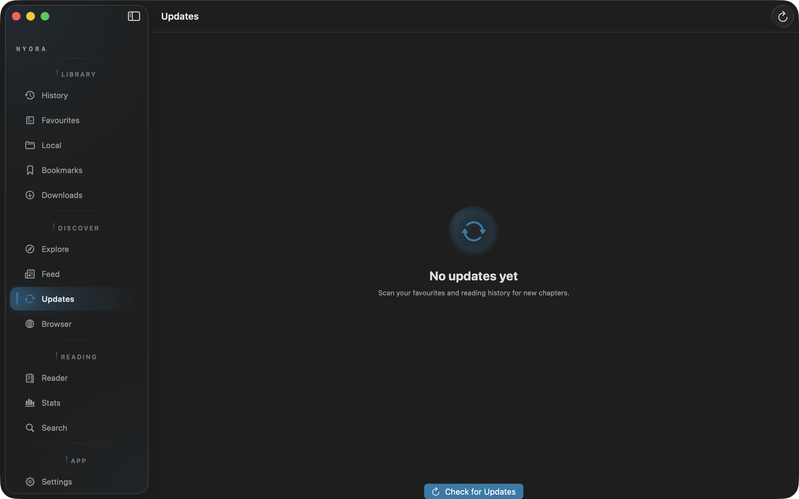
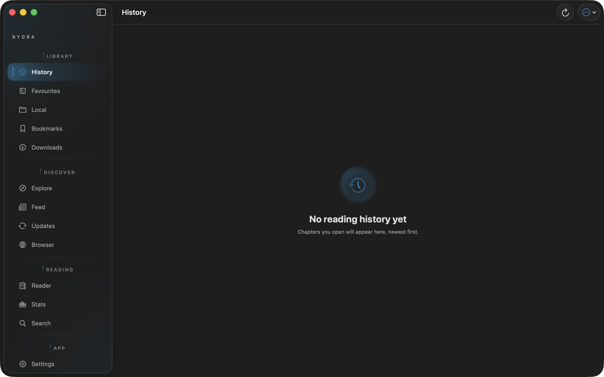
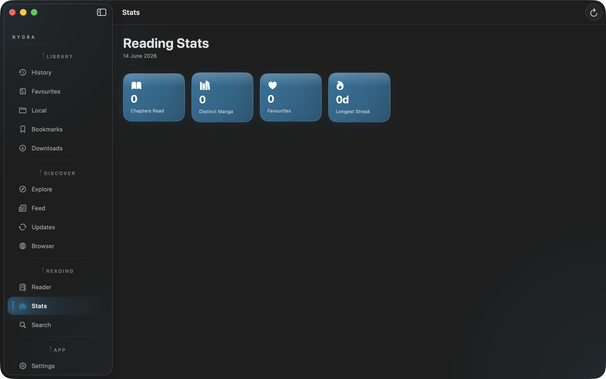

<div align="center">


# Nyora — macOS

### Read like the world can wait.

A fast, free, ad-free, open-source manga reader — native to macOS, built from scratch in SwiftUI. Hundreds of online sources, whole-page AI translation that runs entirely on your Mac, offline downloads, and free cloud sync across every device you own. No ads, no trackers, and no account needed just to read.

<br/>

[](https://www.swift.org)
[](https://developer.apple.com/xcode/swiftui/)
[](https://www.apple.com/mac/)
[](https://www.apple.com/macos/)
[](https://www.swift.org)
[](https://kotlinlang.org)
[](https://developer.apple.com/documentation/coreml)
[](https://onnxruntime.ai)
[](https://brew.sh)

[](LICENSE)
[](https://github.com/Nyora-Manga/nyora-mac/releases/latest)
[](https://github.com/Nyora-Manga/nyora-mac/releases)
[](https://github.com/Nyora-Manga/nyora-mac/stargazers)
[](https://github.com/Nyora-Manga/nyora-mac/issues)

[](https://github.com/Nyora-Manga/nyora-mac/releases/latest)
[](#installation)
[](https://nyora.xyz)
[](https://web.nyora.xyz)
[](https://raw.githubusercontent.com/Nyora-Manga/nyora-data-driven/main/catalogue.json)

**Free · ad-free · open-source · on-device translation · no account to read**

</div>

---

| | |
|:-:|:-:|
| <br/>**Feed** — See what is trending across sources, powered by AniList. | <br/>**Explore** — Browse every installed source from one window. |
| <br/>**Details** — Full cover, synopsis and chapter list with room to breathe. | <br/>**Reader** — A focused desktop reader with per-title settings. |
| <br/>**Search** — Matches from every source, side by side. | <br/>**Settings** — Appearance, reader, trackers, translation and cloud sync. |

> More screens — history, updates, stats and global search — are in the [Screenshots](#screenshots) section below and in [`docs/screenshots/`](docs/screenshots/).

---

## About

Nyora is a native macOS manga reader written from the ground up in SwiftUI for Apple Silicon. It connects to hundreds of online catalogues, reads manga, manhwa and manhua in a clean dedicated reader, translates whole pages with an on-device AI pipeline, downloads chapters for offline reading, and keeps everything in sync across your Mac, Windows, Linux, Android, iOS and the Web — for free. No ads, no trackers, and no account required just to read. It is licensed under Apache-2.0, original code built from scratch.

**New here? In one line:** install it ([Homebrew one-liner below](#installation)), open it, and start reading — your library is yours, lives on your Mac, and syncs only if you choose to sign in.

## Why You'll Love It

- **It just reads.** A clean, native macOS reader with page and webtoon modes, instant resume, and no clutter between you and the panel.
- **Translation that respects the art.** Press ⌘T and the page is recognised on your Mac, translated, and typeset back over the original artwork — not dumped as a wall of subtitles.
- **Truly yours, truly private.** No ads, no analytics, no account to read. Text recognition never leaves your machine, and your library is stored locally.
- **One library, every device.** Sign in once (optional) and your collection, history and progress follow you to Windows, Linux, Android, iOS and the Web.
- **Open and auditable.** Apache-2.0, original code you can read end to end. Nothing hidden, nothing to buy.
- **Frictionless install.** A single Homebrew command, or a drag-and-drop `.dmg`. No store account, no sign-up wall.

## Highlights

| Pillar | What it means on macOS |
|---|---|
| Translate | Whole-page AI translation typeset back over the original art, recognised fully on-device — Apple Vision OCR plus a bundled MangaOCR CoreML model. Press ⌘T for a side-by-side translated sheet. |
| Download | Save chapters for offline reading; downloaded chapters open instantly with zero signal. |
| Sources | Hundreds of online sources spanning manga, manhwa and manhua, browsable and searchable from one reader. |
| Sync | Sign in to your free Nyora Cloud account (email and password) and your library, categories, history, bookmarks and progress follow you to every platform. Free, forever. |
| Open Source | 100% free, ad-free, no tracking, no account to read. Apache-2.0, original code, auditable and community-driven. |

## Table of Contents

- [About](#about)
- [Why You'll Love It](#why-youll-love-it)
- [Highlights](#highlights)
- [Features](#features)
  - [Translate](#translate)
  - [Download & Offline](#download--offline)
  - [Sources & Discovery](#sources--discovery)
  - [Cloud Sync](#cloud-sync)
  - [Reader](#reader)
  - [Trackers](#trackers)
  - [Privacy & Open Source](#privacy--open-source)
  - [Themes & Personalisation](#themes--personalisation)
- [Capability Matrix](#capability-matrix)
- [Keyboard Shortcuts](#keyboard-shortcuts)
- [Screenshots](#screenshots)
- [Installation](#installation)
- [Build from Source](#build-from-source)
- [Configuration](#configuration)
- [Tech Stack](#tech-stack)
- [Architecture](#architecture)
- [Nyora on Every Platform](#nyora-on-every-platform)
- [Roadmap](#roadmap)
- [FAQ](#faq)
- [Contributing](#contributing)
  - [Ways to Contribute](#ways-to-contribute)
  - [Development Setup](#development-setup)
  - [Where Things Live](#where-things-live)
  - [Good First Contributions](#good-first-contributions)
  - [Pull Request & Issue Etiquette](#pull-request--issue-etiquette)
- [Acknowledgements](#acknowledgements)
- [License](#license)

## Features

### Translate

Reading a series that never got an official translation? Nyora recognises the text on-device — nothing about the page is sent to a server for OCR. Apple's Vision framework runs as a four-language ensemble (Japanese, Simplified Chinese, Korean and English passes), carrying the bulk of horizontal and Latin recognition that a single-language pass would miss or mis-segment. Vertical Japanese (tategaki) is where general-purpose OCR fails, so Nyora bundles a dedicated MangaOCR model converted to CoreML — purpose-built for the stylised, vertically-set text inside speech bubbles. The two recognisers are merged, deduped and cleaned, then each line is translated and the result typeset back over the original artwork, so you read the panel as the artist drew it rather than as a wall of subtitles.

Press ⌘T at any time while reading to open a side-by-side translated sheet: the manga page on the left, and every text region paired with its translation on the right, one row per line. Recognition runs locally via Apple Vision and Core ML, so it works without a connection once the page is loaded, and your reading is never used to train anyone's model. Translation itself goes through a free, keyless endpoint; an optional bring-your-own-key LLM pass (Mistral or OpenAI) can polish the output into manga-quality English. For the full stage-by-stage engineering breakdown, see [`macApp/scripts/README-translation.md`](macApp/scripts/README-translation.md).

### Download & Offline

Save chapters for the train, the plane, or the dead-zone cabin. Once a chapter is downloaded it reads instantly with zero signal — no buffering, no waiting on a flaky connection. Downloaded chapters live in your local library and behave exactly like online ones in the reader, so your offline experience is identical to your online one. On-device translation works on loaded pages without a connection too.

### Sources & Discovery

Browse, search and filter across hundreds of online sources spanning manga, manhwa and manhua, all surfaced through one clean reader and one consistent UI. Discover new titles from source catalogues, run searches across sources, and apply filters to narrow results — every library you care about behind a single native macOS front end. The source catalogue is powered by the [`nyora-data-driven`](https://github.com/Nyora-Manga/nyora-data-driven) engine via the bundled Kotlin helper.

### Cloud Sync

Create a free Nyora Cloud account with just an email and password, and your library, custom categories, reading history, bookmarks and per-chapter progress follow you everywhere — Mac, Windows, Linux, Android, iOS and the Web. It is free, forever. Start a chapter on your phone at lunch and finish it on your Mac that night, picking up exactly where you left off. Sync is entirely optional: you never need an account just to read, and signing in only links the data needed to mirror your library across devices.

### Reader

The reader supports both a standard page reader and a continuous webtoon mode, with left-to-right, right-to-left and vertical reading directions. It offers zoom, double-page spreads, and per-title settings so each series can keep its own reading layout. Resume is instant, and reading history is kept automatically so you always know where you stopped.

### Trackers

Tracker integration keeps your external lists in sync as you read, so your progress on the services you already use stays accurate without manual updates.

### Privacy & Open Source

No ads. No trackers. No account just to read. Nyora is licensed under Apache-2.0, with original code built from the ground up — auditable, hackable, and community-driven. Text recognition for translation never leaves your Mac, and you stay in control of your data. Pull requests are welcome.

### Themes & Personalisation

Light, dark and system themes follow macOS automatically. Dynamic colour correction can be applied while reading. Organise your collection with favourites in custom categories, keep a full reading history with instant resume, and use incognito mode for the titles you keep to yourself. Built natively in SwiftUI and tuned for Apple Silicon, the app is fast, fluid, and right at home on macOS.

## Capability Matrix

What the macOS build does today:

| Capability | Status | Detail |
|---|---|---|
| Whole-page AI translation | Yes | On-device OCR (Apple Vision ensemble + MangaOCR CoreML); ⌘T side-by-side sheet. |
| On-device text recognition | Yes | Recognition never leaves the Mac; translation uses a free, keyless endpoint. |
| BYOK LLM polish | Optional | Paste a Mistral or OpenAI key to refine the raw translation. |
| Offline downloads | Yes | Chapters open instantly with no connection. |
| Hundreds of sources | Yes | Powered by the [`nyora-data-driven`](https://github.com/Nyora-Manga/nyora-data-driven) engine. |
| Cross-device sync | Yes | Nyora Cloud account (email + password); free, optional. |
| External trackers | Yes | Progress syncs as you read. |
| Page & webtoon reader | Yes | LTR / RTL / vertical, zoom, double-page spreads, per-title settings. |
| Themes | Yes | Light / dark / system, dynamic colour correction. |
| Incognito mode | Yes | Read without writing history. |
| Ads / trackers | None | No ads, no analytics, no account to read. |
| Architecture | Apple Silicon only | Native SwiftUI for M-series Macs. |

## Keyboard Shortcuts

| Shortcut | Action |
|---|---|
| ⌘T | Open the side-by-side AI translation sheet for the current page. |

## Screenshots

| | |
|:-:|:-:|
| <br/>**Feed** — See what is trending across sources, powered by AniList. | <br/>**Explore** — Browse every installed source from one window. |
| <br/>**Details** — Full cover, synopsis and chapter list with room to breathe. | <br/>**Reader** — A focused desktop reader with per-title settings. |
| <br/>**Search** — Matches from every source, side by side. | <br/>**Global search** — One field that queries every installed source at once; press Return to run. |
| <br/>**Updates** — New chapters across your whole library in one feed. | <br/>**History** — Your recent reading at a glance. |
| <br/>**Stats** — Chapters read, distinct manga, favourites and your longest streak. | <br/>**Settings** — Appearance, reader, trackers, translation and cloud sync. |

> Every screenshot above lives in [`docs/screenshots/`](docs/screenshots/).

## Installation

Nyora for macOS runs on Apple Silicon only. A few ways in — pick whichever you prefer. No store account, no sign-up, nothing to buy.

### One-line install (recommended)

Paste this into Terminal — it downloads Nyora, installs it to `/Applications`, and clears the download quarantine so it opens cleanly with **no "damaged" / "unidentified developer" prompt**:

```bash
curl -fsSL https://github.com/Nyora-Manga/nyora-mac/releases/latest/download/install.sh | bash
```

The build is ad-hoc signed (not Apple-notarised), so a plain download would be Gatekeeper-quarantined and macOS would refuse to open it. The installer removes that quarantine flag after install — which is what lets the valid ad-hoc signature launch normally. Re-run the same command any time to update.

### Homebrew

Also opens cleanly with no Gatekeeper prompt:

```bash
brew tap Hasan72341/nyora
brew trust hasan72341/nyora
brew install --cask --no-quarantine nyora
```

The `--no-quarantine` flag skips the quarantine attribute Gatekeeper would otherwise apply, so the app opens cleanly the first time.

### Direct download (.dmg)

Download `Nyora.dmg` from the [Releases page](https://github.com/Nyora-Manga/nyora-mac/releases/latest) and drag **Nyora** to your Applications folder.

Nyora is ad-hoc signed (not yet notarised), so on first launch macOS plays it safe and asks you to confirm. **This is expected, and it's safe** — the app is fully open-source and you can read every line of what you're running. You only do this once:

- Right-click the app and choose **Open**, then confirm in the dialog, or
- On Sequoia, open **System Settings → Privacy & Security** and click **Open Anyway**.

After that, Nyora launches normally like any other app.

> **Why the prompt?** Apple's Gatekeeper warns about any app it can't trace to a paid Apple Developer notarisation. That's a signal about *provenance*, not about *safety* — open-source apps distributed outside the App Store routinely show it. Notarised distribution is on the [roadmap](#roadmap); until then, Homebrew with `--no-quarantine` skips the prompt entirely.

### Requirements

- A Mac with Apple Silicon (M-series).
- macOS recent enough to run the bundled SwiftUI app.

### Updating

- **Homebrew:** `brew upgrade --cask nyora`.
- **Direct `.dmg`:** download the latest from [Releases](https://github.com/Nyora-Manga/nyora-mac/releases/latest) and replace the app in Applications.

### Troubleshooting

- **"Nyora can't be opened because Apple cannot check it for malicious software."** Expected for the ad-hoc signed `.dmg`. Use right-click → **Open**, or **Open Anyway** in Privacy & Security. Installing via Homebrew with `--no-quarantine` avoids this entirely.
- **Translation seems slow on the first page.** The on-device OCR ensemble and CoreML model warm up on first use; subsequent pages are faster.

## Build from Source

Building the full app requires **Xcode**, **JDK 17**, and the `nyora-shared` submodule — the shared Kotlin engine that ships as a bundled JVM helper. The engine is open-source and public ([github.com/Nyora-Manga/nyora-shared](https://github.com/Nyora-Manga/nyora-shared), Apache-2.0), so a complete from-scratch build resolves it automatically — engine included.

```bash
git clone --recurse-submodules https://github.com/Nyora-Manga/nyora-mac.git
cd nyora-mac
./macApp/scripts/dev-launch.sh    # dev run
./macApp/scripts/build-dmg.sh     # → build/Nyora.dmg (ad-hoc signed, bundled JRE)
```

- `dev-launch.sh` runs the app for local development. It wraps the SwiftPM binary in a full `.app` bundle (with `Info.plist`, the CoreML models, the helper jar and ad-hoc signing) and opens it — necessary because a raw binary is treated as a headless process by macOS. The script is idempotent: re-run it after any code change.
- `build-dmg.sh` produces `build/Nyora.dmg`, ad-hoc signed and packaged with a bundled JRE so the shared engine runs without a separate Java install.

If you cloned without `--recurse-submodules`, initialise the submodule before building:

```bash
git submodule update --init --recursive
```

> **A note for contributors:** the `nyora-shared` engine submodule is a **public, open-source** repository ([github.com/Nyora-Manga/nyora-shared](https://github.com/Nyora-Manga/nyora-shared), Apache-2.0). Clone with `--recurse-submodules` and the whole stack — the Swift / SwiftUI app, the translation pipeline, and the shared Kotlin engine — builds from open source. Full-stack contributions are welcome, engine included. See [Contributing](#contributing) for what you can pick up today.

## Configuration

Nyora ships with working defaults, so the app builds and runs from a fresh clone with no configuration needed. One setting can be overridden locally if you want to point things at your own infrastructure:

- **Nyora Cloud sync.** Sync and accounts run on **Nyora Cloud**, a self-hosted FastAPI backend at `https://stream.hasanraza.tech`. You sign in or register with an email and password (OAuth2 password flow, JWT under the hood) — there is no Google sign-in and no third-party account. If you'd rather run your own backend, point sync at your own Nyora Cloud instance by overriding the backend URL; it's the same open FastAPI service. This is purely optional and only matters if you're self-hosting sync.

None of this is required to build, run, or read — it only configures optional cloud sync.

## Tech Stack

[](https://www.swift.org)
[](https://developer.apple.com/xcode/swiftui/)
[](https://www.apple.com/mac/)
[](https://www.apple.com/macos/)
[](https://www.swift.org)
[](https://kotlinlang.org)
[](https://developer.apple.com/documentation/coreml)
[](https://onnxruntime.ai)
[](https://brew.sh)

- **Swift 6** — the entire macOS front end, written with full data-race safety (Swift 6 language mode).
- **SwiftUI** — native UI framework tuned for Apple Silicon.
- **Kotlin 2.1 (`nyora-shared`)** — the shared source/engine layer, reused across all Nyora platforms, run on macOS as a bundled JVM helper communicating over a loopback REST API.
- **Apple Vision** — on-device OCR running a four-language ensemble (ja / zh-Hans / ko / en) for horizontal and Latin text.
- **Core ML** — runs the bundled MangaOCR model for recognising dense, vertical Japanese manga lettering (tategaki).
- **ONNX Runtime** — on-device manga colorization (`manga-colorization-v2` model).
- **Web OCR (WKWebView)** — same ONNX models from the web app run verbatim in a hidden WebView as a fallback.
- **SQLDelight** — local SQLite database in the Kotlin engine for the manga library.
- **Homebrew** — the recommended distribution and install channel for macOS.

## Architecture

Nyora for macOS is a SwiftUI front end paired with a shared Kotlin engine. The engine (`nyora-shared`) is the same source/catalogue layer used across every Nyora platform; on macOS it ships as a bundled JVM helper and communicates with the Swift app over a loopback REST API on localhost. The build bundles a JRE so the helper runs without requiring a system Java installation.

The translation pipeline keeps recognition entirely on-device. Apple Vision performs OCR across four language passes, and a bundled MangaOCR CoreML model reads vertical Japanese via an overlapping 4×5 tile grid. The two result sets are merged with IoU and similar-text dedupe, pre-filtered to strip repetition, scanlator credits and number garbage, then translated and rendered into the ⌘T side-by-side sheet. Only the cleaned lines ever leave the machine — and only for translation. The full pipeline reference, settings and debug log are documented in [`macApp/scripts/README-translation.md`](macApp/scripts/README-translation.md).

## Nyora on Every Platform

One library. Every device. Sync ties it all together.

| Platform | Repo | Get it |
|---|---|---|
| macOS | **nyora-mac** *(you are here)* | [.dmg / `brew`](https://github.com/Nyora-Manga/nyora-mac/releases/latest) |
| Android | [nyora-android](https://github.com/Nyora-Manga/nyora-android) | [APK](https://github.com/Nyora-Manga/nyora-android/releases/latest) |
| Windows | [nyora-windows](https://github.com/Nyora-Manga/nyora-windows) | [.exe (x64/ARM64)](https://github.com/Nyora-Manga/nyora-windows/releases/latest) |
| Linux | [nyora-linux](https://github.com/Nyora-Manga/nyora-linux) | [deb · rpm · curl](https://github.com/Nyora-Manga/nyora-linux/releases/latest) |
| iOS / iPadOS | [nyora-ios](https://github.com/Nyora-Manga/nyora-ios) | [sideload IPA](https://github.com/Nyora-Manga/nyora-ios/releases/latest) |
| Web | [nyora-web](https://github.com/Nyora-Manga/nyora-web) | [web.nyora.xyz](https://web.nyora.xyz) |
| Shared engine | [nyora-shared](https://github.com/Nyora-Manga/nyora-shared) | open-source Kotlin engine (Apache-2.0) — vendored as a submodule by the desktop ports |
| Data-driven engine | [`nyora-data-driven`](https://github.com/Nyora-Manga/nyora-data-driven) | 35 generic source templates — powers the source catalogue |

Every platform shares the same library and progress through cloud sync — sign in once and your collection is everywhere.

## Roadmap

Honest, already-stated future work for the macOS build:

- **Notarised distribution.** The `.dmg` is currently ad-hoc signed; the `build-dmg.sh` output is already notarisable, with full notarisation to remove the Gatekeeper prompt as a goal.
- **Translation pipeline improvements.** Sharper bubble detection, better dedupe heuristics, and additional target languages are open areas — see the [translation deep-dive](macApp/scripts/README-translation.md) for current limits.

No dates or versions are promised; this list reflects work the project has openly described.

## FAQ

**Is Nyora free?**
Yes — completely free, ad-free, and with no tracking. There is nothing to buy and no premium tier. It is open-source under Apache-2.0, so you can verify that for yourself.

**Is it safe, and why is it "unsigned"?**
Yes, it's safe. macOS shows a Gatekeeper prompt for any app that isn't notarised through a paid Apple Developer account — that's about where the app came from, not whether it's harmful. Because Nyora is open-source, every line you run is public and auditable. Installing via Homebrew with `--no-quarantine` skips the prompt; with the direct `.dmg`, right-click → **Open** once and you're set. See [Installation](#installation).

**Do I need an account?**
No. You never need an account just to read. Creating a free Nyora Cloud account (email and password) is entirely optional and only enables cross-device sync.

**Will my data be private?**
Yes. No ads, no analytics, no trackers. Your library is stored locally on your Mac. Text recognition for translation runs fully on-device — nothing about the page is sent off-device for OCR. Only recognised lines are sent for translation, through a free, keyless endpoint.

**Are there ads or trackers?**
No. There are no ads and no trackers, and you do not need an account just to read.

**Where does the manga come from?**
Nyora connects to hundreds of online sources spanning manga, manhwa and manhua. Nyora is a reader, not a host — it is not affiliated with any of these sources and stores none of their content itself.

**How does the AI translation work, and is it private?**
Text recognition runs entirely on your Mac: Apple Vision performs a four-language OCR ensemble, and a bundled MangaOCR CoreML model reads vertical Japanese. Nothing about the page is sent off-device for OCR. Only the recognised lines are sent for translation, through a free, keyless endpoint. You can optionally add your own Mistral or OpenAI key to polish the result. Press ⌘T to open the side-by-side sheet; the full breakdown is in [`macApp/scripts/README-translation.md`](macApp/scripts/README-translation.md).

**What languages does translation handle?**
Recognition covers Japanese, Simplified Chinese, Korean and English. The translation target defaults to English; Hindi works as well. Set the source language to Japanese in **Settings → AI Translation** to engage the vertical-Japanese MangaOCR pass.

**Does it work offline?**
Yes. Download chapters for offline reading and they open instantly with no connection. Once a page is loaded, on-device recognition works offline too; the translation call itself needs a connection unless the page is already cached.

**Is sync private and required?**
Sync is optional and free. You only create a Nyora Cloud account (email and password) if you want your library, history, bookmarks and progress to follow you across platforms — it links just the data needed to mirror your collection. You never need an account just to read.

**Which platforms are supported, and do they share my library?**
macOS, Windows, Linux, Android, iOS / iPadOS and the Web — all of which share one library and reading progress through cloud sync. This repository is the macOS app (Apple Silicon only).

**Can I contribute to the shared engine?**
Yes. The cross-platform engine, `nyora-shared`, is now a public, open-source repository ([github.com/Nyora-Manga/nyora-shared](https://github.com/Nyora-Manga/nyora-shared), Apache-2.0). Clone this repo with `--recurse-submodules` and you can build and modify the whole stack — the Swift app, the translation pipeline, and the engine itself. Engine-level PRs (the source/parser runtime, the loopback REST server, the SQLDelight store, Nyora Cloud sync, the downloads manager) are welcome upstream. See [Contributing](#contributing).

**How do I update?**
If you installed via Homebrew, update with `brew upgrade --cask nyora`. If you installed the `.dmg` directly, download the latest from the [Releases page](https://github.com/Nyora-Manga/nyora-mac/releases/latest) and replace the app in Applications.

## Contributing

Nyora is built in the open, and contributions are genuinely welcome — whether you write Swift, design, translate, test, or just file a good bug report. You do not need to be an expert, and you do not need to understand the whole codebase to make a real difference. If you have a Mac and a few minutes, there is something here you can start on today.

**A note on the build:** the cross-platform engine lives in the `nyora-shared` submodule, which is **public and open-source** ([github.com/Nyora-Manga/nyora-shared](https://github.com/Nyora-Manga/nyora-shared), Apache-2.0). Clone with `--recurse-submodules` and a complete from-scratch build resolves it automatically — nothing held back. The part most contributions touch is the **Swift / SwiftUI app** and the **translation pipeline** in this repo, but the engine itself is open too, so full-stack changes are on the table.

### Ways to Contribute

You don't have to write code to help — every one of these moves the project forward:

- **Report a bug.** Hit something odd? Open an [issue](https://github.com/Nyora-Manga/nyora-mac/issues) with what you did, what you expected, and what happened. A screenshot and your macOS version help a lot.
- **Suggest a feature or polish.** Ideas for the reader, translation UX, or settings are welcome — open an issue and describe the problem you want solved.
- **Test releases.** Try a new `.dmg` or `brew` build and report whether it installs and runs cleanly on your Mac. Real-world install testing is genuinely valuable.
- **Improve or translate the UI.** Better wording, clearer labels, or UI strings in your language all help — the interface lives in plain SwiftUI views (see [Where Things Live](#where-things-live)).
- **Write docs.** Clarify a confusing step, fix a typo, or improve this README and the [translation deep-dive](macApp/scripts/README-translation.md). Documentation PRs are some of the easiest to review and merge.
- **Work on the shared engine.** `nyora-shared` is open-source and welcomes PRs upstream — the source/parser runtime, the loopback REST server, the SQLDelight store, Nyora Cloud sync and the downloads manager are all fair game for engine-level contributions.
- **Help with sources.** The [`nyora-data-driven`](https://github.com/Nyora-Manga/nyora-data-driven) engine is open-source and welcomes contributions to existing templates and new source definitions. For iOS-native porting, the biggest open opportunity is the NyoraEngine in [nyora-ios](https://github.com/Nyora-Manga/nyora-ios).
- **Star and share.** Honestly — starring the repo and telling one friend who reads manga is one of the most useful things you can do. Discovery is the hardest part of an open-source project's life.

### Development Setup

This is the contributor quickstart for working on the **macOS app** (distinct from the end-user [build above](#build-from-source)):

```bash
# 1. Clone with submodules
git clone --recurse-submodules https://github.com/Nyora-Manga/nyora-mac.git
cd nyora-mac

# 2. Prerequisites: Xcode (Swift toolchain) and JDK 17

# 3. Run the app for local development
./macApp/scripts/dev-launch.sh
```

`dev-launch.sh` is idempotent — re-run it after any code change to rebuild and relaunch. The Swift package and Xcode project both live under [`macApp/`](macApp/).

A few notes:

- **UI, reader, and translation work** is fully approachable in this repo — these are Swift/SwiftUI and Core ML, no special setup needed beyond a normal clone.
- **A complete from-scratch build** also resolves the `nyora-shared` engine submodule, which is public and open-source ([github.com/Nyora-Manga/nyora-shared](https://github.com/Nyora-Manga/nyora-shared), Apache-2.0). Everyone can build the whole stack, and engine-level changes — the source/parser runtime, the loopback REST server, the SQLDelight store, Nyora Cloud sync, the downloads manager — are open for PRs upstream.

If you cloned without submodules, run `git submodule update --init --recursive`. (For maintainers: bumping the engine is the usual `git submodule update --remote nyora-shared` followed by committing the new submodule pointer.)

### Where Things Live

A quick map so you can find your way around the macOS app:

| Path | What's there |
|---|---|
| [`macApp/Nyora/NyoraApp/Views/`](macApp/Nyora/NyoraApp/Views) | SwiftUI screens — the reader (`Reader.swift`, `WebtoonScrollView.swift`), explore/search (`ExploreView.swift`, `GlobalSearchSheet.swift`), details, downloads, settings, and the translation sheet (`TranslationSheet.swift`). Best place to start for UI fixes. |
| `macApp/Nyora/NyoraApp/ViewModels/` | App state and models (`AppState.swift`, `Models.swift`, `ReaderPrefs.swift`, `TrackerSettings.swift`). |
| `macApp/Nyora/NyoraApp/AI/` | The on-device translation pipeline — OCR, the MangaTranslator, painters and refiners (`MangaTranslator.swift`, `OcrProvider.swift`, `ChapterTranslator.swift`, `TranslationModels.swift`). |
| `macApp/Nyora/NyoraApp/Bridge/` | The bridge to the bundled Kotlin helper and auth (`NyoraHelperBridge.swift`, `HelperLauncher.swift`). |
| [`macApp/scripts/`](macApp/scripts) | Dev/build scripts (`dev-launch.sh`, `build-dmg.sh`) and the translation deep-dive (`README-translation.md`). |
| [`nyora-shared/`](https://github.com/Nyora-Manga/nyora-shared) | The shared Kotlin engine — **public, open-source submodule** (Apache-2.0): source/parser runtime, loopback REST server, SQLDelight store, Nyora Cloud sync and downloads manager. PRs welcome upstream. |
| [`docs/`](docs) | Screenshots and reference notes. |

### Good First Contributions

If you want a concrete starting point, these tend to be small, self-contained, and easy to review:

- **Docs and copy.** Fix a typo, clarify an install step, or improve a section of this README or [`macApp/scripts/README-translation.md`](macApp/scripts/README-translation.md).
- **Small UI fixes.** Tighten a layout, fix a label, or improve an empty/placeholder state in a SwiftUI view under `macApp/Nyora/NyoraApp/Views/` (e.g. `PlaceholderViews.swift`, `WelcomeView.swift`).
- **Reader and translation polish.** Improvements to the ⌘T side-by-side sheet (`TranslationSheet.swift`, `TranslationOverlayView.swift`) or reader settings (`ReaderSettingsSheet.swift`) — a great way into the translation pipeline; read the [deep-dive](macApp/scripts/README-translation.md) first.
- **Porting sources** (parallel, high-impact). If you'd like a steady stream of mechanical, template-driven tasks, the [nyora-ios](https://github.com/Nyora-Manga/nyora-ios) engine has the most room — see its README for the template and current status.

### Pull Request & Issue Etiquette

A few lightweight conventions keep reviews fast and friendly:

- **Keep PRs focused.** One change per pull request is far easier to review and merge than a sprawling one.
- **Describe the change.** Say what it does and why; link the issue it addresses if there is one. A before/after screenshot helps for anything visual.
- **Open an issue first for big changes.** A quick discussion on [Issues](https://github.com/Nyora-Manga/nyora-mac/issues) saves everyone time before you write a lot of code.
- **Be kind.** This is a community project maintained by people in their spare time. Assume good faith, and we'll do the same.

There is no `CONTRIBUTING.md` or formal code of conduct file yet — the guidance above is it. Be respectful, keep it constructive, and you're welcome here.

**Thank you for being here.** Whether you ship a feature, fix a typo, file a thoughtful bug, or just star the repo and pass it to a friend — it genuinely helps, and it's appreciated. If Nyora makes your reading better, a star is the single fastest way to help more people find it.

## Acknowledgements

Nyora's source/engine layer is powered by the [`nyora-data-driven`](https://github.com/Nyora-Manga/nyora-data-driven) project. The project is grateful to the wider open-source manga-reader community whose work makes broad catalogue support possible, and to the open-source libraries and models — including the MangaOCR CoreML model and ONNX Runtime — that power on-device translation. Thanks to everyone who reports bugs, suggests features, and contributes code.

## License

Licensed under the **Apache License 2.0** — see [`LICENSE`](LICENSE). Original code, built from scratch.

---

Developed and maintained by **Md Hasan Raza** — [GitHub](https://github.com/Hasan72341) · [Instagram](https://instagram.com/md_hasan_raza____) · [LinkedIn](https://www.linkedin.com/in/md-hasan-raza) · hasanraza96@outlook.com

> Nyora is not affiliated with any of the manga sources it can access.