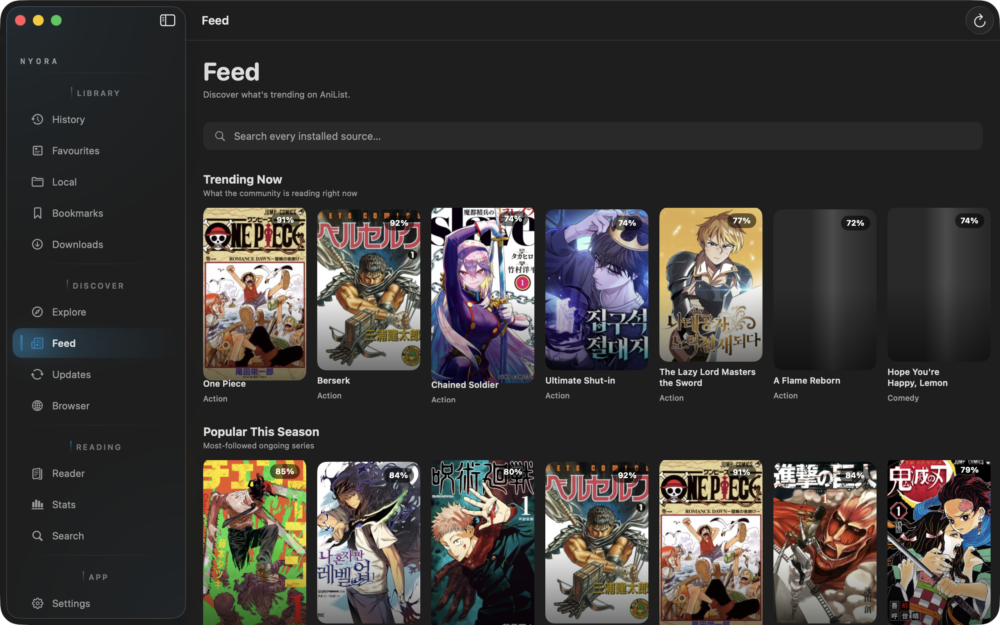
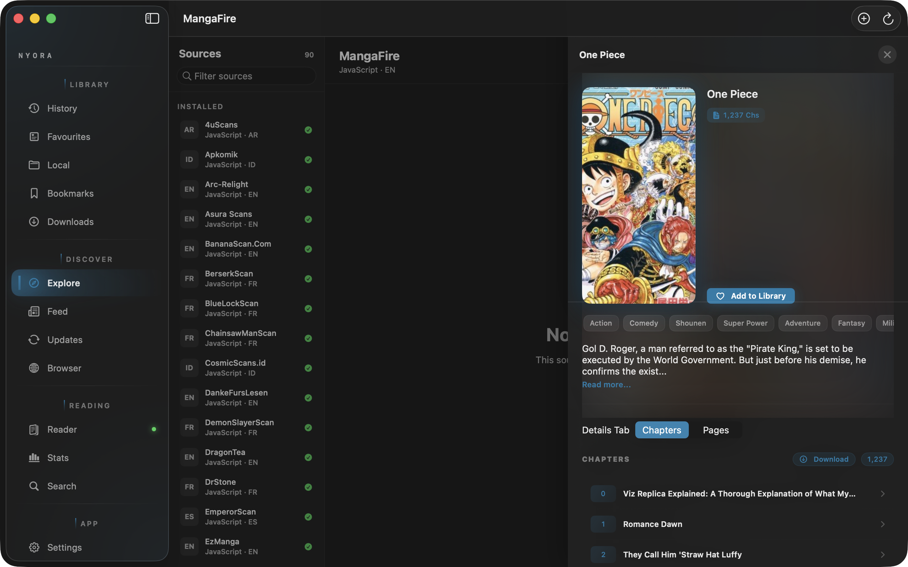
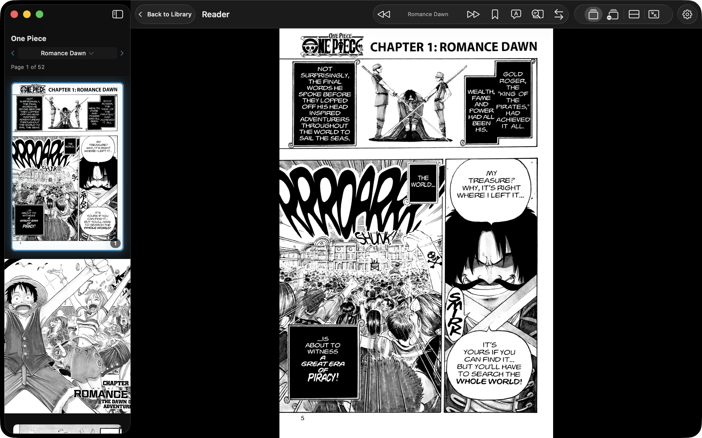
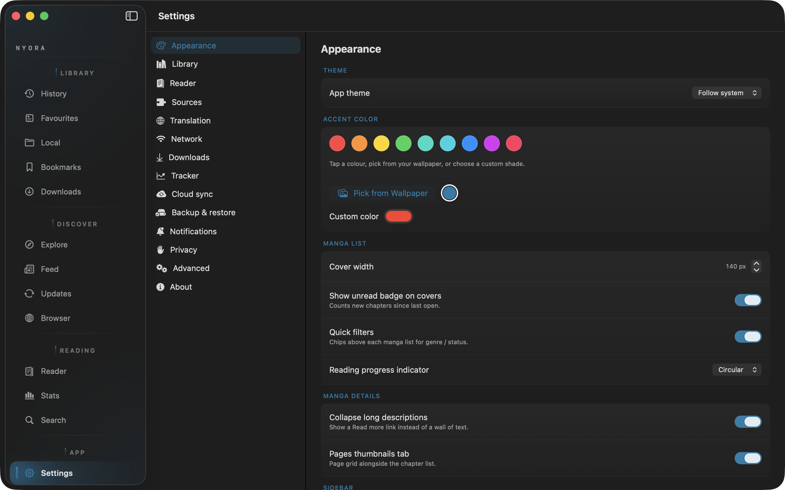

<div align="center">


# Nyora — macOS

### Read like the world can wait.

A native **macOS** manga reader built from scratch in **SwiftUI** — hundreds of online sources, on-device AI page translation, and a `.dmg` with a bundled Java runtime. Install via Homebrew or drag-and-drop.

[](LICENSE)
[](https://github.com/Hasan72341/nyora-mac/releases/latest)
[](https://github.com/Hasan72341/nyora-mac/releases)
[](https://github.com/Hasan72341/nyora-mac/stargazers)

**[⬇️ Download .dmg](https://github.com/Hasan72341/nyora-mac/releases/latest)** · **[🌐 nyora.pages.dev](https://nyora.pages.dev)**

</div>

---

## 📸 Screenshots

| | |
|:-:|:-:|
|  |  |
|  |  |
|  |  |

> More screens (history, updates, stats, search) are in [`docs/screenshots/`](docs/screenshots/).

---

## ✨ Features

- 📚 **Hundreds of online sources** — browse, search & filter manga, manhwa & manhua.
- 🌐 **AI page translation** — Apple **Vision** OCR (with a rotated-ensemble pass that handles vertical Japanese / tategaki) + a bundled **MangaOCR** model detect the text, which is translated and typeset back over the art (⌘T for a side-by-side sheet).
- 📖 **Standard & Webtoon reader** — LTR / RTL / vertical, zoom, double-page, per-title settings.
- 🎨 **Dynamic colour correction** while reading.
- 🗂️ Favourites in custom categories, history, resume, **incognito**, offline downloads.
- 🔄 **Tracker integration** + ☁️ **cloud sync** (sign in with Google; library & progress sync across devices).
- 🌗 Light / dark / system themes.

## ⬇️ Install

**Homebrew** (easiest — no Gatekeeper prompt):

```bash
brew tap Hasan72341/nyora
brew trust hasan72341/nyora
brew install --cask --no-quarantine nyora
```

**Or** download `Nyora.dmg` from the **[Releases page](https://github.com/Hasan72341/nyora-mac/releases/latest)** and drag **Nyora** to Applications. The app is ad-hoc signed (not notarised), so allow it once: right-click → **Open** (or Settings → Privacy & Security → **Open Anyway** on Sequoia). **Apple Silicon only.**

## 🛠️ Build from source

Requires **Xcode**, **JDK 17**, and the `nyora-shared` submodule.

```bash
git clone --recurse-submodules https://github.com/Hasan72341/nyora-mac.git
cd nyora-mac
./macApp/scripts/dev-launch.sh    # dev run
./macApp/scripts/build-dmg.sh     # → build/Nyora.dmg (ad-hoc signed, bundled JRE)
```

## 🧩 Nyora on every platform

| Platform | Repo | Get it |
|---|---|---|
| 🍎 macOS | **nyora-mac** *(you are here)* | [.dmg / `brew`](https://github.com/Hasan72341/nyora-mac/releases/latest) |
| 🤖 Android | [nyora-android](https://github.com/Hasan72341/nyora-android) | [APK](https://github.com/Hasan72341/nyora-android/releases/latest) |
| 🪟 Windows | [nyora-windows](https://github.com/Hasan72341/nyora-windows) | [.exe (x64/ARM64)](https://github.com/Hasan72341/nyora-windows/releases/latest) |
| 🐧 Linux | [nyora-linux](https://github.com/Hasan72341/nyora-linux) | [deb · rpm · curl](https://github.com/Hasan72341/nyora-linux/releases/latest) |
| 📱 iOS / iPadOS | [nyora-ios](https://github.com/Hasan72341/nyora-ios) | [sideload IPA](https://github.com/Hasan72341/nyora-ios/releases/latest) |
| 🌍 Web | — | [nyoraweb.pages.dev](https://nyoraweb.pages.dev) |

## 🏗️ Tech

**SwiftUI** front end · a shared Kotlin engine (`nyora-shared`) run as a bundled JVM helper over a loopback REST API · Apple Vision + CoreML for OCR.

## 🤝 Contributing

Issues & PRs welcome. ⭐ **Star the repo** if you like Nyora!

## 📄 License

Licensed under the **Apache License 2.0** (see [`LICENSE`](LICENSE)). Original code, built from scratch — source-compatible with Tachiyomi/Kotatsu-style sources but not a fork.

## 🙏 Credits

Developed & maintained by **Md Hasan Raza** — [GitHub](https://github.com/Hasan72341) · [Instagram](https://instagram.com/md_hasan_raza____) · [LinkedIn](https://www.linkedin.com/in/md-hasan-raza) · hasanraza96@outlook.com

> Nyora is not affiliated with any of the manga sources it can access.
